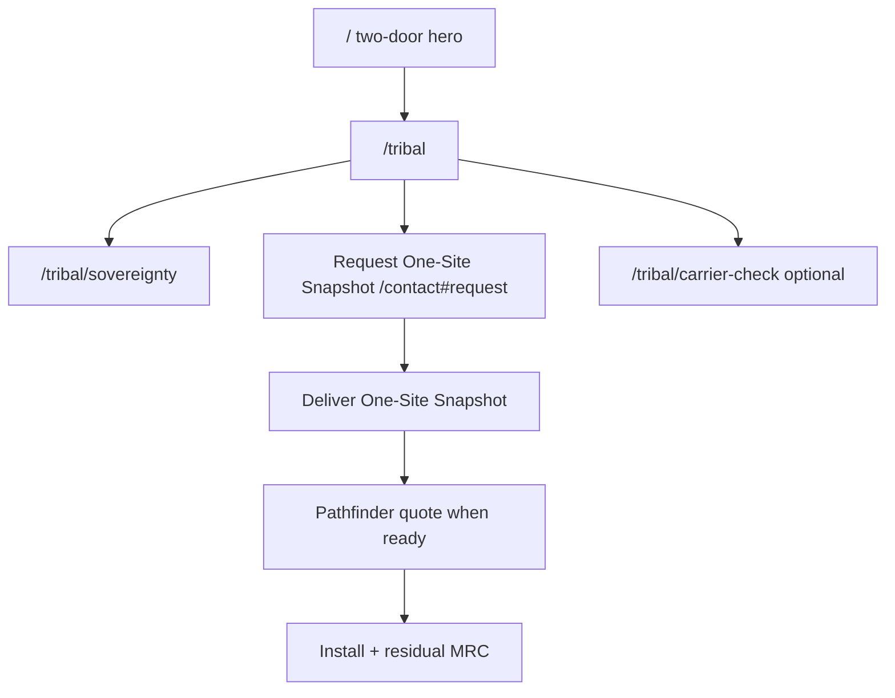
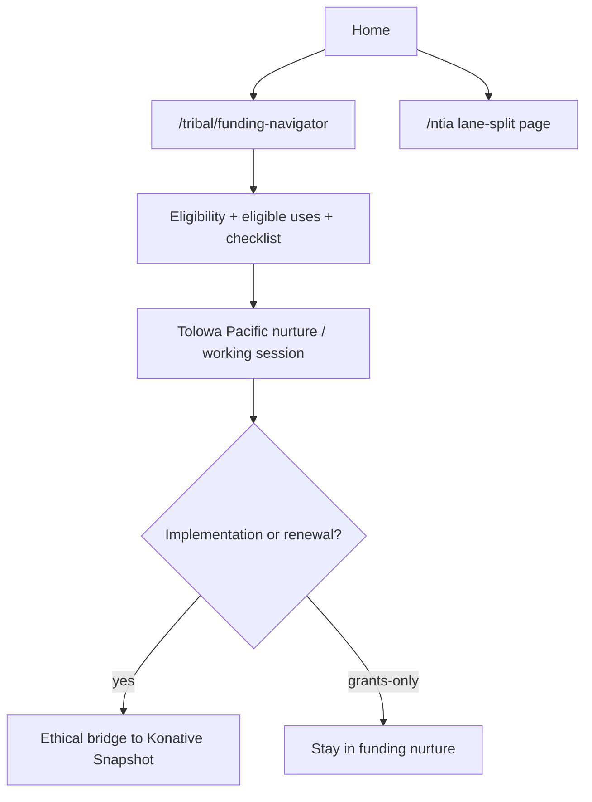
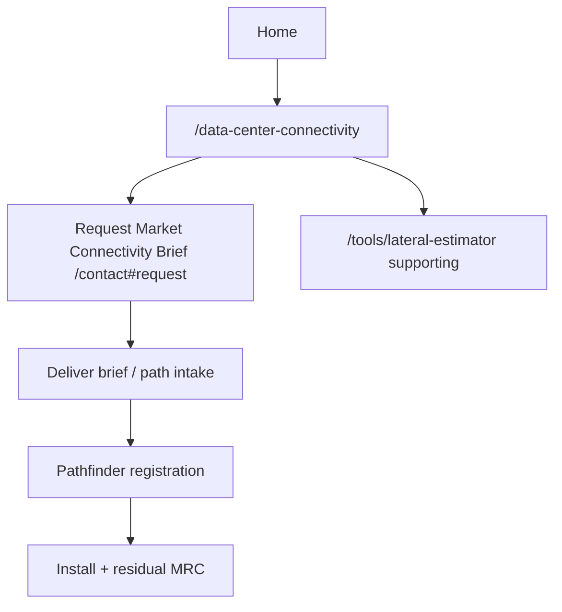

# Lane Conversion Maps — Tribal Enterprise, Funding Help, Data Center

**Prepared:** 2026-07-14  
**Design system:** Preserve existing bright-black / steel / velocity-red Konative patterns.

## E1 — Tribal enterprise (commercial)

**First job of `/tribal`:** brand + one commercial promise (One-Site Snapshot) + sovereignty link + clear separation from grants.  
**Form fields:** property, address, role, timing, current concern.  
**Do not lead with** book-a-call as the only CTA.

## E2 — Tribal funding help

**Claims:** Cite current NOFO; TBCP may fund infrastructure, backhaul/middle/last mile, leases/IRUs, engineering, network design, consulting, related costs.  
**Never** pitch Konative brokerage as if it were the grant product.

## E3 — Data-center connectivity

**Primary CTA:** Market Connectivity Brief, not generic discovery call.  
**Partners:** referral lane keeps their scope; Konative takes network only.

## E4 — Instrumentation tags (site → CRM)

| Event | How |
| --- | --- |
| Landing source | UTM + referrer on form |
| Lane | tribal-ops / funding / data-center / partner |
| Artifact requested | form note or `schemaType` |
| Human response | CRM disposition |
| Pathfinder ID | opportunity field |
| MRC / stage / install / residual | Twenty opportunity fields |

## Page CTA matrix (target)

| Page | Primary CTA | Secondary |
| --- | --- | --- |
| `/tribal` | One-Site Snapshot → `/contact#request` | Sovereignty, Funding Navigator |
| `/tribal/funding-navigator` | Grant working session / checklist | Bridge to Snapshot only when relevant |
| `/ntia` | One-Site Snapshot | Funding Navigator |
| `/data-center-connectivity` | Market Connectivity Brief | Lateral estimator / map |
| `/tribal/awards/[slug]` | One-Site Snapshot | Back to awards index |
